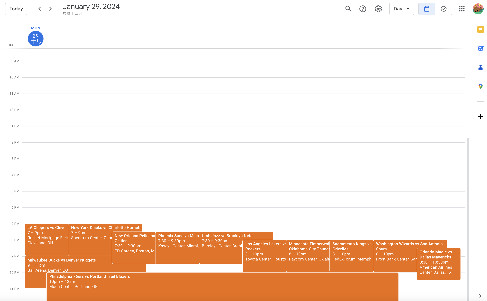

# NBA Tip Off Tracker

Hey, programmer! Are you an `NBA enthusiast`? If you know Python, have a Google account, and know your way around the command line, we've got a cool hack for you! This project automates the process of scraping NBA game schedule information and adding it to your Google Calendar, saving you time and keeping you updated on your favorite NBA games.

## Demo



Read on to learn how to set up the necessary environment and run the automation script.

## Prerequisites

Before you can run the automation script, make sure you have the following prerequisites installed and set up:

- Python 3.x
- pip package manager
- virtualenv (for creating a virtual environment)
- Google Workspace (for accessing Google Calendar API)

## Getting Started

Follow these steps to get started with the project:

### 1. Set Up OAuth 2.0

To access the Google Calendar API, you need to set up OAuth 2.0 credentials. Here's how:

1. Go to the [Google Cloud Console](https://console.cloud.google.com/).
2. Create a new project or select an existing one.
3. Enable the "Google Calendar API" for your project.
4. Configure the OAuth consent screen with the necessary information.
5. Create credentials of type "OAuth client ID."
6. Download the credentials as a JSON file (usually named `credentials.json`).

Or you can follow this amazing video tutorial by [Jie Jenn](https://www.youtube.com/watch?v=6bzzpda63H0)

### 2. Create `client_secret.json`

Rename the downloaded `credentials.json` file to `client_secret.json` and place it in the following directory:

```
project/nba_game_time/nba_game_time/
```

`project` is the root directory of your project, where the automation script is located.

### 3. Create a Virtual Environment

To isolate project dependencies, create a virtual environment:

```bash
python -m venv venv
```

Activate the virtual environment:

- On Windows:

```bash
venv\Scripts\activate
```

- On macOS and Linux:

```bash
source venv/bin/activate
```

### 4. Install Dependencies

Install the required Python packages using `pip`:

```bash
pip3 install -r requirements.txt
```

### 5. Run the Automation Script

Now, you're ready to run the automation script. Navigate to the project directory and execute the following command:

```bash
source automate_process.sh
```

The script will scrape NBA game schedule information and add it to your Google Calendar.

## Note

- The first time you run the script, it will prompt you to authenticate and authorize access to your Google Calendar. Follow the instructions to complete the authorization process.

